  <h1>Hi 👋, I'm Sanjeev Kumar</h1>
  <h3>Student | Full-Stack Developer | Tech Enthusiast</h3>
  
  

    <em>Passionate about building scalable web applications and exploring Cloud Computing & AI.</em>
  

  

    
    
    
    
    
  

---

### 👨‍💻 About Me
-  I’m currently a **Computer Science Engineering** undergraduate focusing on **Full-Stack Web Development** and smart, **ML-powered applications**.
- I build with **React, Python, TypeScript, and Tailwind CSS**, aiming to create scalable, user-centric solutions.
- 💬 Ask me about **Python, C++, JavaScript, TypeScript, React, Node.js, and Machine Learning**.
- 📫 Open to **Software Engineering Internships, Collaborations, and Entry-Level Roles**.

---

### 🛠️ Tech Stack & Tools

  <h3>🌐 Frontend</h3>
  
  
    

  <h3>⚙️ Backend</h3>
  

    

  <h3>☁️ DevOps/Tools</h3>
  

    

  <h3>🤖 ML/Data</h3>
  

---

<!-- ### 🚀 Coding Profiles

  
  
  
  
  

--- -->

### 📊 GitHub Analytics

  <!-- GitHub Readme Stats (Currently experiencing 503 errors from the public Vercel instance)
  <a href="https://github.com/Sanjeev-Kumar78">
    <picture>
      <source media="(prefers-color-scheme: dark)" srcset="https://github-readme-stats.vercel.app/api?username=Sanjeev-Kumar78&show_icons=true&theme=radical&hide_border=true">
      <source media="(prefers-color-scheme: light)" srcset="https://github-readme-stats.vercel.app/api?username=Sanjeev-Kumar78&show_icons=true&theme=default&hide_border=true">
      
    </picture>
  </a>
  <a href="https://github.com/Sanjeev-Kumar78">
    <picture>
      <source media="(prefers-color-scheme: dark)" srcset="https://github-readme-stats.vercel.app/api/top-langs/?username=Sanjeev-Kumar78&layout=compact&theme=radical&hide_border=true">
      <source media="(prefers-color-scheme: light)" srcset="https://github-readme-stats.vercel.app/api/top-langs/?username=Sanjeev-Kumar78&layout=compact&theme=default&hide_border=true">
      
    </picture>
  </a>
    
  -->
  <!-- Generated Metrics -->
  
    
  <!-- Holopin Badges -->
  

---

  
    
  
    
  

